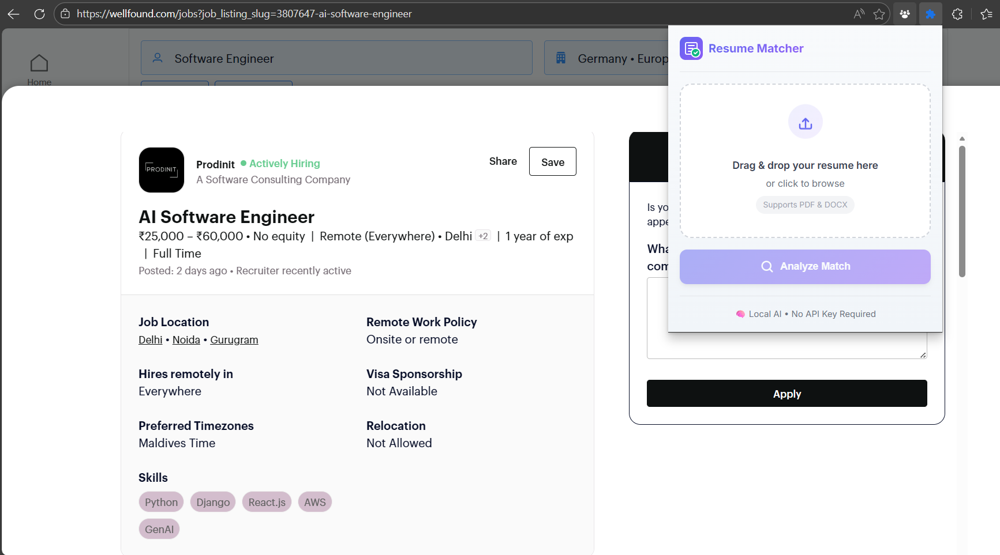
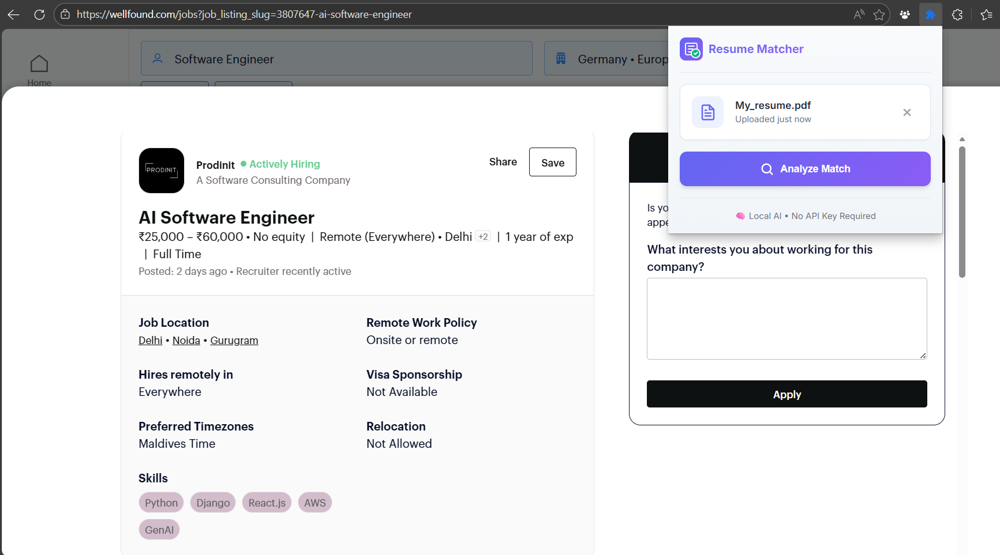
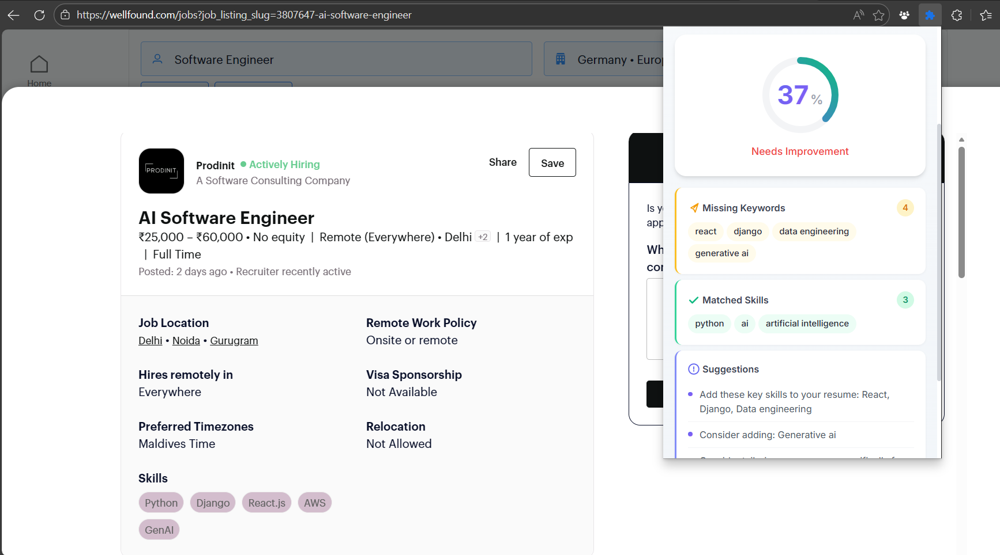

# 🎯 Smart Resume Matcher - Browser Extension

A **100% free** browser extension that analyzes your resume against job descriptions and gives you an ATS-style match score. **No API key required!**


## ✨ Features

- 📊 **ATS-Style Match Score** - Get a percentage showing how well you match
- ✅ **Matched Skills** - See which skills you have that the job wants
- ⚠️ **Missing Skills** - Know exactly what's missing from your resume
- 💡 **Smart Suggestions** - Actionable tips to improve your application
- 🔒 **100% Private** - All processing happens in your browser
- 🆓 **Completely Free** - No API keys, no tokens, no subscriptions

## 🚀 Installation

1. Clone or download this repository
   ```bash
   git clone https://github.com/Siddharth-Rangwa/Smart_Resume_Matcher.git
   ```
2. Open Chrome and go to `chrome://extensions/`
3. Enable **Developer mode** (toggle in top right)
4. Click **Load unpacked**
5. Select the `Smart_Resume_Matcher` folder

## 📖 How to Use

1. **Upload your resume** (PDF or DOCX)
2. **Navigate to any job posting** (LinkedIn, Naukri, Indeed, Wellfound, etc.)
3. **Click the extension icon**
4. **Click "Analyze Match"**
5. **Get your results!**

## 📸 Demo

### Extension Interface


### Match Analysis Results


### Keyword Analysis & Suggestions


## 🎯 Supported Job Portals

- LinkedIn
- Naukri.com
- Indeed
- Wellfound (AngelList)
- Glassdoor
- Monster
- And many more...

## 🧠 How It Works

The extension uses **local NLP (Natural Language Processing)** to:

1. **Extract skills** from both your resume and the job description
2. **Match keywords** using a database of 500+ tech and soft skills
3. **Calculate semantic similarity** using TF-IDF algorithms
4. **Check experience requirements** against your background
5. **Generate suggestions** based on the gaps found

### Scoring Formula

```
Final Score = (Keyword Match × 45%) + (Semantic Similarity × 35%) + (Experience Match × 20%)
```

## 📁 Project Structure

```
Smart_Resume_Matcher/
├── manifest.json        # Extension configuration
├── popup.html           # UI markup
├── popup.css            # Styles
├── popup.js             # UI logic
├── matchingEngine.js    # NLP matching algorithm
├── skillsDatabase.js    # 500+ skills database
├── resumeParser.js      # PDF/DOCX parser
├── content.js           # Job description extractor
├── background.js        # Service worker
├── libs/                # PDF.js, Mammoth.js
└── icons/               # Extension icons
```

## 🛠️ Tech Stack

- **Manifest V3** - Latest Chrome extension standard
- **PDF.js** - Mozilla's PDF parser
- **Mammoth.js** - DOCX to text converter
- **TF-IDF** - Text similarity algorithm
- **Local NLP** - No external APIs needed

## 🔒 Privacy

- ✅ All processing happens **locally in your browser**
- ✅ Your resume is stored **only in Chrome's local storage**
- ✅ **No data is sent** to any external server
- ✅ **No tracking** or analytics

## 📊 Accuracy

Our local NLP approach provides **75-85% accuracy** compared to real ATS systems. This is sufficient to:

- ✅ Identify if you're a good match
- ✅ Find critical missing skills
- ✅ Get actionable improvement tips
- ✅ Compare yourself across multiple jobs

## 🤝 Contributing

Contributions are welcome! Feel free to:

- Report bugs
- Suggest features
- Submit pull requests

## 📄 License

MIT License - feel free to use and modify!

---

**Made with ❤️ for job seekers everywhere**
